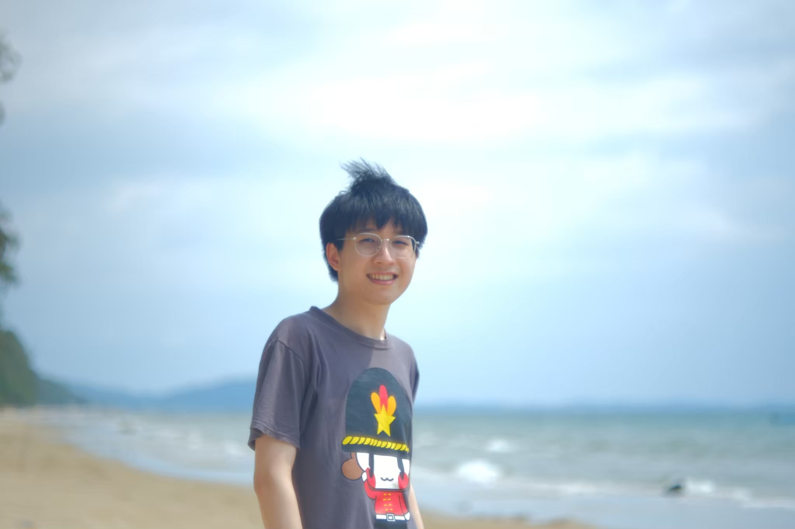

---
# Feel free to add content and custom Front Matter to this file.
# To modify the layout, see https://jekyllrb.com/docs/themes/#overriding-theme-defaults

layout: home
title: Home
nav_order: 1
---

# Welcome to Nutchanon J's homepage.

Hi! My name is Nutchanon Jariyanurut. I'm currently studying as a fourth year student at [Department of Electrical Engineering](https://ee.eng.chula.ac.th/), [Faculty of Engineering](https://www.eng.chula.ac.th/th/), [Chulalongkorn University](https://www.chula.ac.th/en/).

My interests are electronics (especially digital and analog design,) control systems, and anything related to maths in general (including AI, ML and data analytics.)

My spirit animal is in a phylum of [Cnidaria](https://en.wikipedia.org/wiki/Cnidaria).

This is the main page for publishing my works. For my blog, please go [here](https://nutchanonj.github.io/myblog/).

