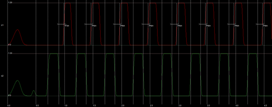

# Non-Overlapping Clock Generator

This work is done by me and Makkawan Lohitsiri.

## Design Approach

The logics are connected as followed.


This circuit uses 0.12 μm technology. It needs to drive two 100 fF output loads.

There’re 4 inverters in each rail after the NAND2 output (a2, a3, a4, a5 and b2, b3, b4, b5.) This number is determined by experiments. (When there are only 2 inverters, the non-overlapping period is less than 50 ps.)

Sizing is chosen to minimize the size of circuit. However, due to the large output load, there must be a buffer for each phase clock. (a6, a7, b6, b7.)

The output load is 100 fF, while the output capacitance of the last inverter in the chain is about 9.5 fF. Therefore, the sizing of inverters in the buffer must be in the ratio of sqrt(100/9.5) = 3.24.

## Design Summary

The sizing of each gate is shown in the table:

||a6, b6|a7, b7|other|
|W (PMOS)|2.94 μm|12.24 μm|0.60 μm|
|W (NMOS)|1.50 μm|6.12 μm|0.30 μm|
|L|0.12 μm|0.12 μm|0.12 μm|

The progressive sizing of capacitances at nodes E1, P1, M1, S1 (and also E2, P2, M2, S2) are approximately 3-4 to ensure that the delay is minimized.

The size of the two-phase circuit is 6.54 x 14.46 μm. The total size of buffers is 11.04 x 15.48 μm. Therefore, the total size is 265.47 μm^2

The total capacitance of each node is 312.4 fF. (This include the 100x2 fF output load.) The power consumption is therefore (312.4 fF)(1.2 V)2(2 GHz) = 0.8997 mW.

The length of non-overlapping period between s2 and s1 is 84 ps. It is measured between s2 crossing 50% to the s1 crossing 50%. This meets the specification (> 50 ps.)



The length of non-overlapping period between s1 and s2 is 84 ps. It is measured between s1 crossing 50% to the s2 crossing 50%. This meets the specification (> 50 ps.)


The length of high times of s1 and s2 are 0.154 ns and 0.176 ns. It is measured between (rising) crossing 50% to the (falling) crossing 50%. This meets the specification (> 100 ps.)


The rise time and fall time of s1 and s2 are both approximately 30 ps. It is measured between crossing 10% to the crossing 90%. Note that this is not met by the specification. (< 20 ps.)


To design the circuit layout, the primitive INV and NAND2 units are designed first.

|||
|Inverter|NAND2|

The layout of two-phase clock generator with its equivalent circuit are given below.


To generate the layout above, Microwind 3.1 have a design automation using primitive Verilog circuit description. The written file is give here

```verilog
module TwoPhaseClock (input  wire CLK);

	wire A1, B1, C1, D1, E1, Temp, A2, B2, C2, D2, E2, P1, P2;

	inv inv_a1(A1,CLK);
	inv inv_b1_1(Temp,CLK);
	inv inv_b1_2(A2,Temp);

	nor nor_a(B1,A1,P2);
	nor nor_b(B2,A2,P1);

	inv inv_a2(C1,B1);
	inv inv_b2(C2,B2);

	inv inv_a3(D1,C1);
	inv inv_b3(D2,C2);

	inv inv_a4(E1,D1);
	inv inv_b4(E2,D2);

	inv inv_a5(P1,E1);
	inv inv_b5(P2,E2);

endmodule
```

The layout of output buffer with its equivalent circuit are given below.


The buffers are designed to have fin-like gates to minimize capacitance and resistance.

The entire circuit has passed the DRC checked by Microwind.

The full layout is given below.


