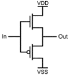

# One-Bit Serial Adder

This work is done by me and Makkawan Lohitsiri.

## Section 1: Before Layouting

This one-bit serial adder is made by using 0.12 μm CMOS technology. The logic that we will use are static CMOS logics because it is the most reliable and easy to implement.

First, the functional circuit is purposed as a behavioral style in Verilog

```verilog
module serial_adder 
    (   input clk, reset,   //clock and reset
        input a, b,         //
        output s, cout      //
        );

wire c1, c2;
reg cin;

assign s = a ^ b ^ cin;
assign c1 = (a & b) | (cin & b) | (a & cin);
assign cout = (reset == 1'b0) ? 1'b0 : c1; 

always @ (posedge clk or negedge reset)
    if (reset == 1'b0) begin //active high reset
        cin <= 1'b0;
    end else begin
        cin <= cout;
    end 

endmodule
```

Then, the circuit is tested against this input sequence to check its function. 


The corresponding testbench is provided here.

```verilog
module tb;

    // Inputs
    reg clk, reset, a, b;

    // Outputs
    wire s, cout;

    // Instantiate the Unit Under Test (UUT)
    serial_adder uut (
        .clk(clk), .reset(reset), .a(a), .b(b), .s(s), .cout(cout)
    );

//generate clock with 10 ns clock period.
    always 
    begin
        clk = 1'b1; #25; 
        clk = 1'b0; #25; 
    end
        
    always @(posedge clk)
    begin
        // Initialize Inputs
        clk <= 1;
        a <= 0;
        b <= 0;
        reset <= 0; #100;
        reset <= 1;
        //add two 4 bit numbers, 1111 + 1101 = 11100
        a <= 1; b <= 1;  #50;
        a <= 1; b <= 0;  #50;   
        a <= 1; b <= 1;  #50;      
        a <= 1; b <= 1;  #50;   
        reset <= 0; #50;
        reset <= 1;
        //add two 5 bit numbers, 11011 + 10001 = 101100
        a <= 1; b <= 1;  #50;
        a <= 1; b <= 0;  #50;     
        a <= 0; b <= 0;  #50;    
        a <= 1; b <= 0;  #50;
        a = 1; b = 1;  #50;     
        reset <= 0;
        $finish;
    end
    
endmodule
```

The behavioral simulation of the circuit is done in Xilinx Vivado 2022.2. The waveform is provided below.


The values of s and c(out) are as expected, so we can use this Verilog file to design our circuit.

The schematic of this circuit is also synthesized by Xilinx Vivado 2022.2 as in this picture below.


This will be used for our design in the next section.

## Section 2: Logic Diagram of the Bit-Serial adder.

### Modules

The one-bit serial adder is built by these modular units:

- C_out_circuit: producing a carry from a binary addition.
    
- S_out_circuit: producing a sum from a binary addition.
    
- 2-to-1 multiplexer.
    
- D flip-flop. (Please note that each logic gate with a clock gating is composed of that logic gate and an additional transmission gate.)
    

The overall circuit when integrating all the modules together.


To restart the adder, the active-low reset signal <span style="color:#e09a67">(brown line)</span> is fed to the circuit. The D flip-flop will be reset asynchronously and force the C(in) <span style="color:#ff7070">(red line)</span> to be zero. The multiplexer also forces the output to be zero if the reset signal is still active to prevent the C(in) signal from taking the C(out) value when the calculation is not start yet, so when the calculation is started, the first C(in) fed to the C_out_circuit and S_out_circuit is zero as it should be.

The critical path of a circuit is shown below.


## Section 3: Transistor schematics of the Bit-Serial adder.

### Transistor-level diagram

For clarity, the transistor schematics will be presented on the logic gates level (NAND2, NAND3, INV, transmission gate, XOR2.) 

||NAND2|
||NAND3|
||Inverter|
||Transmission gate|
||XOR2|

### Layout of each primitive cell

These are the primitive cells that we use to build the circuit: NAND2, NAND3, INV, Transmission gate, XOR2.

||NAND2|
||NAND3|
||Inverter|
||Transmission gate|
||XOR2|

## Section 4: Layout of the Bit-Serial adder.

- C_out_circuit.

    

- S_out_circuit.

    

- 2-to-1 multiplexer.

    

- D flip-flop. 

    

- A buffer. 

    

The overall layout of the adder is shown below. It has passed the design rules check (DRC.)


## Section 5: Post-layout Testing.

The testing of one-bit adder will use this sequence:


The reset signal is low for 5 clock cycles and then is high. Then, the A and B are fed to the circuit from the LSB to the MSB for 32 clock cycles. After that, the reset signal will be low again. The waveform are shown here.


*Waveform when CLK frequency = 5 GHz*


*Waveform when CLK frequency = 10 GHz*


*Waveform when CLK frequency = 12.5 GHz*

When the CLK frequency = 12.5 GHz, C(out) and S(out) are not settled yet at the end of some clock cycles. Therefore, our adder can work at the maximum clock frequency of 10 GHz.

Time required for 32-bit addition is 1/(10 GHz) * 32 = 3.2 ns.

## Section 6: Design metrics and performance.

|Maximum Clock Frequency|10 GHz|
|Power Consumption|(0.898 mA)(1.2 V) = 1.078 mW|
|Area|20 x 34 μm|
|Computational Time (32-bit addition)|3.2 ns|