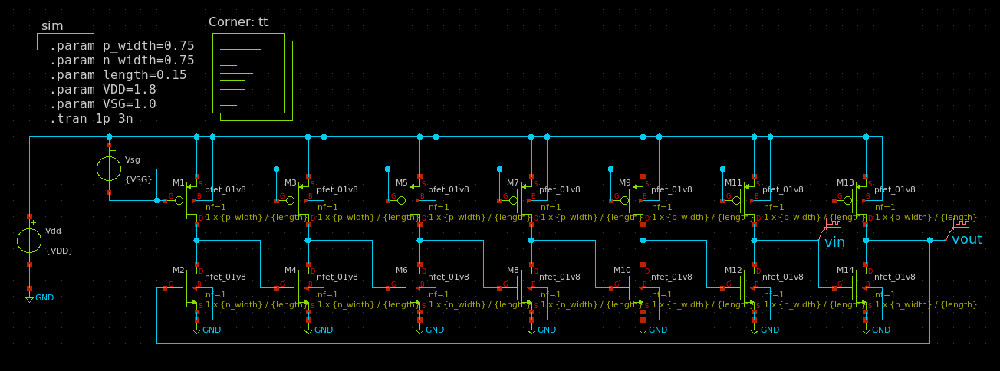
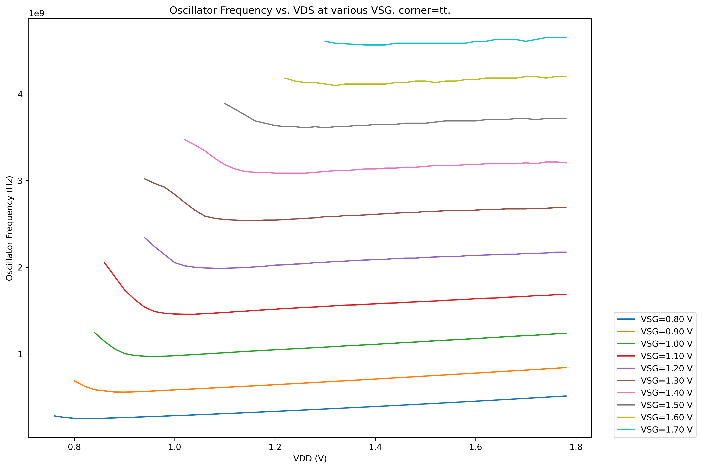
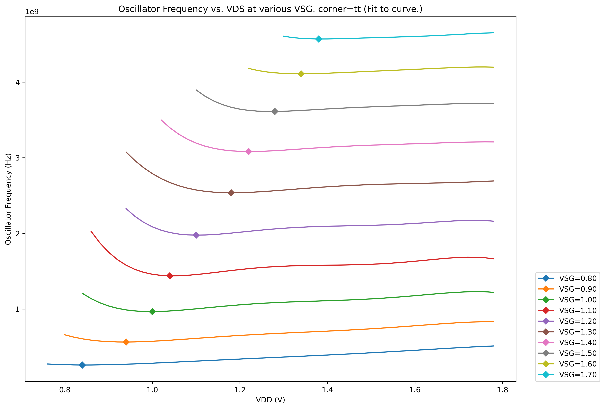
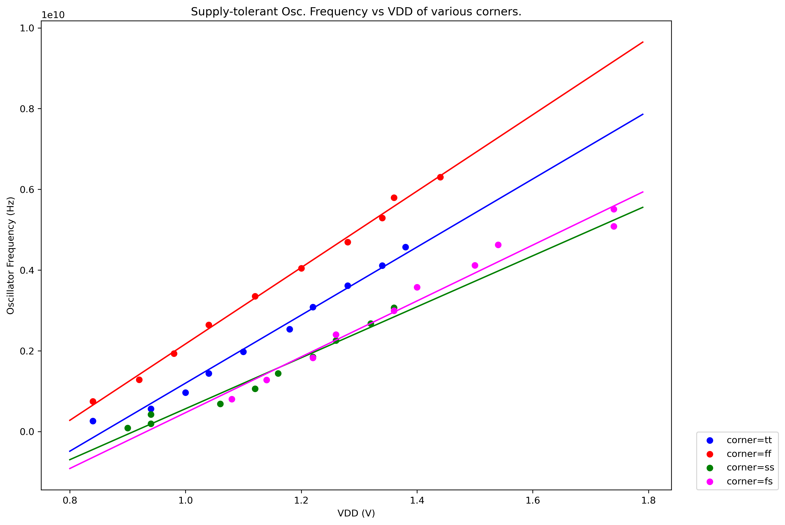
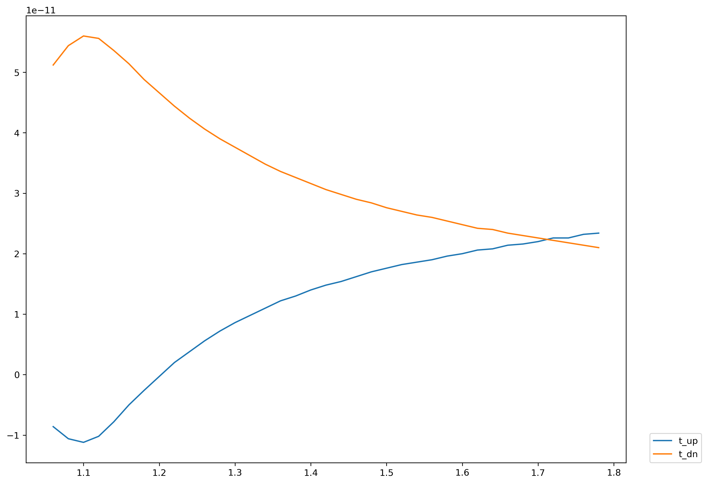
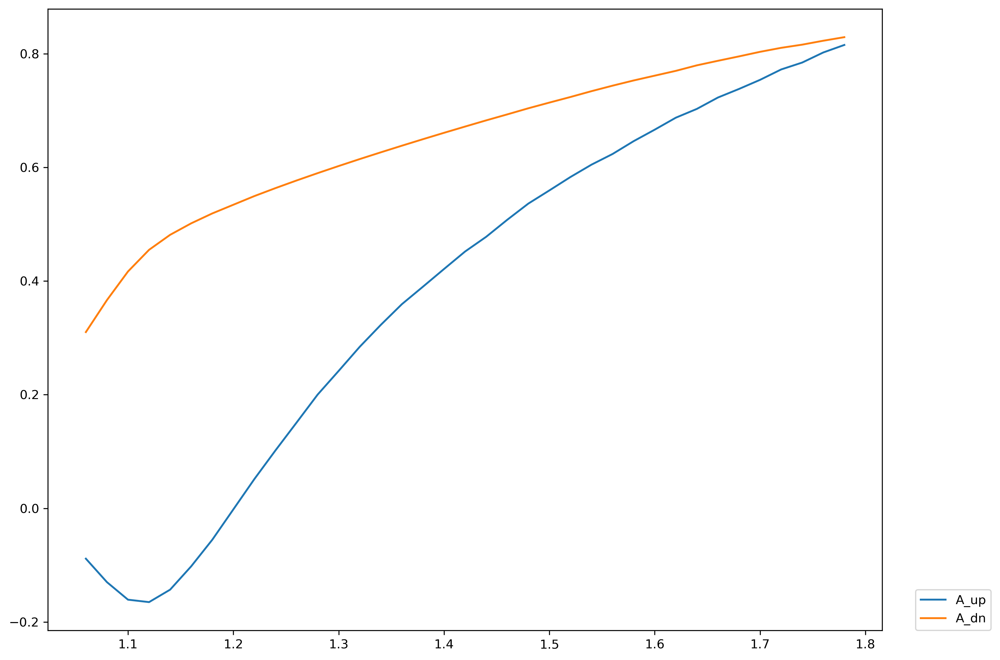

# My Journey on Analog IC Design

{: .warning } 
This page is still under construction. This work is done by me and Makkawan Lohitsiri.

This work utilizes SKY130 PDK. Aims to verify the result from this paper: 

{: .note }
The paper: P. -H. Hsieh, J. Maxey and C. -K. K. Yang, "Minimizing the Supply Sensitivity of a CMOS Ring Oscillator Through Jointly Biasing the Supply and Control Voltages," in IEEE Journal of Solid-State Circuits, vol. 44, no. 9, pp. 2488-2495, Sept. 2009, doi: 10.1109/JSSC.2009.2025406.

Firstly, follow this video ([link](https://www.youtube.com/watch?v=l5ollq9Nbl8)) to install things on Windows (I use the packaged PDK from [iic-osic](https://github.com/iic-jku/osic-multitool))

To make a simple 7-stages VCO, this can be done on xschem.



To make things easier, you can automate frequency measuring by using Python with `pyspice` package. (Given that xschem uses ngspice to simulate the circuit.)

```python
# Code for Generating Plot Between
# Oscillator Frequency vs. VDS at various VSG.
#
# 20 May 2023.
#
# By Nutchanon Jariyanurut and Makkawan Lohitsiri.

# Import required packages.
import PySpice.Logging.Logging as Logging
from PySpice.Spice.NgSpice.Shared import NgSpiceShared
from matplotlib import pyplot as plt
import numpy as np
import pandas as pd

# Setting the logger.
logger = Logging.setup_logging()

# Read the SPICE file.
f = open("vco_simple.spice","r")
lines = f.readlines()

# List of corners.
corner_list = ["tt","ff","ss","sf","fs"]

for corner in corner_list:

    # Zero padding for column data.
    k = 0

    # DataFrame to keep all data. 
    df = pd.DataFrame()

    # VSG range from 0.8 to 1.7 V.
    VSG_list = np.arange(0.8, 1.79, 0.1)

    for VSG in VSG_list:

        # Each VSG has VDD in the range of (VSG - 4) to VDD.
        VDD_list = np.arange(VSG - 0.4, 1.79, 0.02)

        # Keeping frequency at each VDD but same VSG.
        freq_list = []

        for VDD in VDD_list:

            # Initiate ngspice.
            ngspice = NgSpiceShared.new_instance()

            # Change the SPICE file to each corresponding experiment.
            circuit = ""
            for line in lines:
                if ".param VSG=" in line:
                    line = f".param VSG={VSG:.2f}\n"
                if ".param VDD=" in line:
                    line = f".param VDD={VDD:.2f}\n"
                if "corners/tt" in line:
                    line = line.replace("corners/tt", f"corners/{corner}")
                    print(line)
                circuit = "".join([circuit, line])
            
            # Load the SPICE file to ngspice.
            ngspice.load_circuit(circuit)

            # Run the simulation.
            ngspice.run()

            # Pull the experiment.
            plot = ngspice.plot(simulation=None, plot_name=ngspice.last_plot)
                    
            # Pull the waveforms.
            analysis = plot.to_analysis()

            # Change the waveforms to NumPy array.
            v_in = np.array(analysis.vin)
            v_out = np.array(analysis.vout)
            v_time = np.array(analysis.vout.abscissa)

            # Time-series plot.
            plt.figure()
            plt.plot(v_time, v_in, label="V_in")
            plt.plot(v_time, v_out, label="V_out")
            plt.title(f"V_in and V_out waveforms vs. time\n when VDD={VDD:.2f} V and VSG={VSG:.2f} V")
            plt.xlabel("time (s)")
            plt.ylabel("voltage (V)")
            plt.legend(bbox_to_anchor=(1.04, 0), loc="lower left", borderaxespad=0)
            plt.savefig(f"osc_VSG={VSG:.2f}_VDD={VDD:.2f}.png", format="png", dpi=300, bbox_inches = 'tight')
            plt.close()

            # Calculate.
            v_max = (np.max(v_in) + np.max(v_out))/2
            v_min = (np.min(v_in) + np.min(v_out))/2
            v_avg = (v_max + v_min)/2
            v_in_norm = v_in - v_avg
            v_out_norm = v_out - v_avg

            try:
                # If the waveform has not less than 1 period per simulation time, this can be run.
                zero_crossing_times = v_time[np.where(np.diff(np.sign(v_out_norm)))]
                period = zero_crossing_times[-1] - zero_crossing_times[-3]

                freq = 1/period
                print(f"VSG={VSG:.2f}_VDD={VDD:.2f}")
                print(freq)
            except:
                # If the waveform has less than 1 period per simulation time.
                freq = 0

            # Save data.
            freq_list.append(freq)

            # Delete data in ngspice to prevent memory leakage.
            # (But memory leakage is still exist, anyway, so, please beware of OOM-killer in Linux.)
            ngspice.exec_command("destroy all")
            ngspice.exec_command("reset")

        # Save data to df.
        # the row is started from (VSG(min) - 4) to VDD.
        data_column = np.concatenate((np.zeros(k), freq_list))
        df[f"VSG={VSG:.2f}"] = data_column

        # change zero padding for column data.
        k += 5

    # Save df to csv.
    df.to_csv(f"freq_osc_corner={corner}.csv", encoding='utf-8')

# After the csv is generated, data cleaning (manually) is required.
```

Then, the csv file can be cleaned and plotted in a corresponding manner to get:



Some data manipulation by Python will get the lowest points from each lines.



You can see that the lowest points are arranging in a linear trend. If simulations from all corners (TT, FF, SS, SF, FS) are done in the same ways, the result is:



The result from corner SF is not plotted because the trend is not linear anymore. (Maybe because the process in the paper is smaller than 130 nm?)

The `t_up`, `t_down`, `A_up`, `A_down` in the paper can be measured in the same way:

```python
# Code for Generating Plot Between
# Oscillator t_up, t_dn, A_up, A_dn vs. VDS at fixed VSG.
#
# 20 May 2023.
#
# By Nutchanon Jariyanurut and Makkawan Lohitsiri.

# Import required packages.
import PySpice.Logging.Logging as Logging
from PySpice.Spice.NgSpice.Shared import NgSpiceShared
from matplotlib import pyplot as plt
import numpy as np
import pandas as pd

# Setting the logger.
logger = Logging.setup_logging()

# Read the SPICE file.
f = open("vco_simple.spice","r")
lines = f.readlines()

# DataFrame to keep all data. 
df = pd.DataFrame()

# Setting VSG.
VSG = 1.4

# List of VDD.
VDD_list = np.arange(1.04, 1.79, 0.02)

# List to keep data.
t_up_list = []
t_dn_list = []
A_up_list = []
A_dn_list = []

for VDD in VDD_list:

    # Initiate ngspice.
    ngspice = NgSpiceShared.new_instance()

    # Change the SPICE file to each corresponding experiment.
    circuit = ""
    for line in lines:
        if ".param VSG=" in line:
            line = f".param VSG={VSG:.2f}\n"
        if ".param VDD=" in line:
            line = f".param VDD={VDD:.2f}\n"
        circuit = "".join([circuit, line])

    # Load the SPICE file to ngspice.     
    ngspice.load_circuit(circuit)

    # Run the simulation.
    ngspice.run()

    # Pull the experiment.
    plot = ngspice.plot(simulation=None, plot_name=ngspice.last_plot)
            
    # Pull the waveforms.
    analysis = plot.to_analysis()

    # Change the waveforms to NumPy array.
    v_in = np.array(analysis.vin)
    v_out = np.array(analysis.vout)
    v_time = np.array(analysis.vout.abscissa)

    # Time-series plot.
    plt.figure()
    plt.plot(v_time, v_in, label="V_in")
    plt.plot(v_time, v_out, label="V_out")
    plt.title(f"V_in and V_out waveforms vs. time\n when VDD={VDD:.2f} V and VSG={VSG:.2f} V")
    plt.xlabel("time (s)")
    plt.ylabel("voltage (V)")
    plt.legend(bbox_to_anchor=(1.04, 0), loc="lower left", borderaxespad=0)
    plt.savefig(f"osc_VSG={VSG:.2f}_VDD={VDD:.2f}.png", format="png", dpi=300, bbox_inches = 'tight')
    plt.close()

    # Calculate.
    v_max = (np.max(v_in) + np.max(v_out))/2
    v_min = (np.min(v_in) + np.min(v_out))/2
    v_avg = (v_max + v_min)/2
    v_in_norm = v_in - v_avg
    v_out_norm = v_out - v_avg

    # Calculate.
    in_down_change_idx = np.where(np.diff(np.sign(v_in_norm)) == -2)[0]
    out_up_change_idx = np.where(np.diff(np.sign(v_out_norm)) == 2)[0]
    in_up_change_idx = np.where(np.diff(np.sign(v_in_norm)) == 2)[0]
    out_down_change_idx = np.where(np.diff(np.sign(v_out_norm)) == -2)[0]

    try:
        # If the waveform has not less than 3 periods per simulation time, this can be run.
        in_period_idx = in_down_change_idx[-1] - in_down_change_idx[-2]
        in_down_time_idx = in_down_change_idx[2]
        out_up_time_idx = out_up_change_idx[out_up_change_idx > in_down_time_idx - in_period_idx/2][0]
        in_up_time_idx = in_up_change_idx[in_up_change_idx > in_down_time_idx][0]
        out_down_time_idx = out_down_change_idx[out_down_change_idx > in_up_time_idx - in_period_idx/2][0]

        in_down_time = v_time[in_down_time_idx]
        out_up_time = v_time[out_up_time_idx]
        in_up_time = v_time[in_up_time_idx]
        out_down_time = v_time[out_down_time_idx]

        t_up = out_up_time - in_down_time
        t_dn = out_down_time - in_up_time
        A_up = -v_out_norm[in_down_time_idx]
        A_dn = v_out_norm[in_up_time_idx]

        print(f"VSG={VSG:.2f}_VDD={VDD:.2f}")
        print(t_up, t_dn, A_up, A_dn)
    except:
        # If the waveform has less than 1 period per simulation time.
        t_up = 0
        t_dn = 0
        A_up = 0
        A_dn = 0

    # Save data.
    t_up_list.append(t_up)
    t_dn_list.append(t_dn)
    A_up_list.append(A_up)
    A_dn_list.append(A_dn)

    # Delete data in ngspice to prevent memory leakage.
    # (But memory leakage is still exist, anyway, so, please beware of OOM-killer in Linux.)
    ngspice.exec_command("destroy all")
    ngspice.exec_command("reset")

# Save df to csv.
df["t_up"] = t_up_list
df["t_dn"] = t_dn_list
df["A_up"] = A_up_list
df["A_dn"] = A_dn_list
df.to_csv("wave_chars.csv", encoding='utf-8')

# After the csv is generated, data cleaning (manually) is required.
```

The result can be plotted by Python after some data cleaning.



