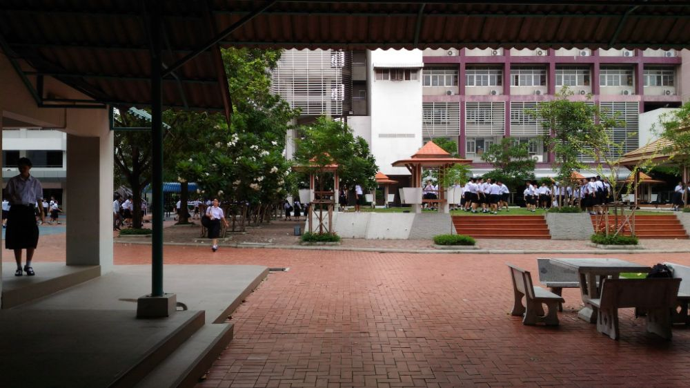
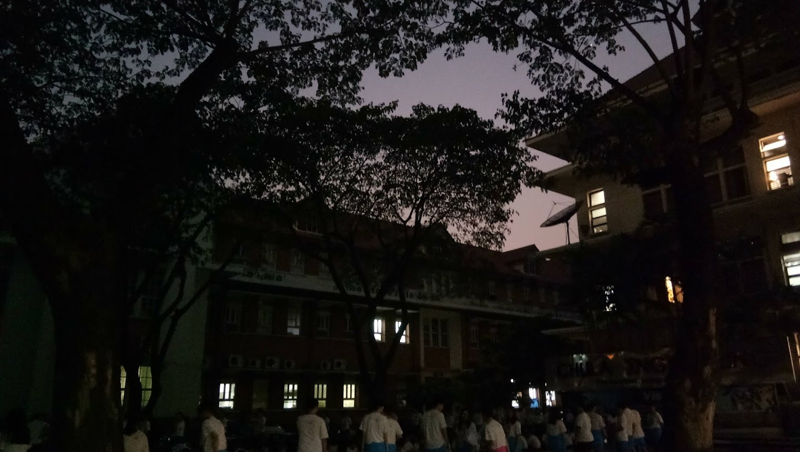
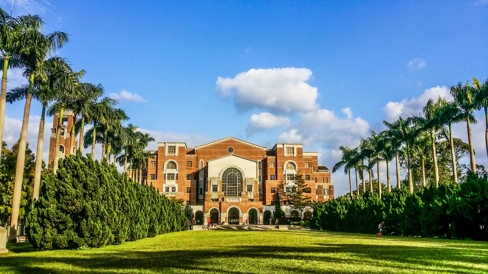

# About me! :wave:

## Background

My name is Nutchanon Jariyanurut. I’m from Chonburi, Thailand. The city where I live is Bang Saen. It’s kinda like a traveler’s attraction with a very beautiful beach. (I recommend you go there in winter; the seawater is very dirty during the monsoon season.) You can see how Bang Saen is [here](https://web.facebook.com/shopjungbangsaen/).

For over 9 years in primary and secondary education, I studied at [Satit Demonstration School](http://www.st.buu.ac.th/).

## High School

*Mahidol Wittayanusorn School*

In high school, I was studying at a very STEM-oriented school, [Mahidol Wittayanusorn School](https://www.mwit.ac.th/html/). There, I was in the National Chemistry Olympiad Team. I received a silver medal in the [13th Thailand Chemistry Olympiad in 2017](https://web.facebook.com/NonJariyanurut/posts/pfbid02VfekkqrG7oJrweQ4zUk3wekvBRFt1kEoV2tkzJEZmTgF9LZJMmAfJYd8Pr2KsVM4l) (I didn't make it to the international Olympiad, though.)

In 2017, I was participating in the [International Chemistry Tournament](http://ichto.org/en/). It is the competition where participants solve the open-ended chemistry problems provided by the tournament, and the scoring is based on debating with scientific foundations. That year, the tournament took place in Russia. I received a [best presentation award](http://ichto.org/en/the-results-of-the-ichto-2017/).

During my high school years, the science project I conducted was the *[Development of a wood density measuring instrument by determining the speed of stress wave in wood with the piezoelectric effect](https://www.nstda.or.th/sims/login/index.php?class=AbstractProposalView&id=29)*. It was presented at [TISF 2019](https://www.facebook.com/TISF2021/), [ASMS International Science Fair 2018](https://asms.sa.edu.au/international-science-fair/), and [YSC 2018](http://fic.nectec.or.th/ysc20_Decisions). In the YSC, it received a special award in the field of engineering and physics science projects.

## Undergrad

*Faculty of Engineering, Chulalongkorn University (at night)*

From 2019 to 2023, I was studying in the [Department of Electrical Engineering](https://ee.eng.chula.ac.th/) at [Chulalongkorn University](https://www.chula.ac.th/en/). My interests are electronics (especially digital and analog design), control systems, and anything related to maths in general (including AI, ML, and data analytics).

During my second and third years at the university, I was an active member of the [Engineering Student Committee](https://web.facebook.com/escchula). My work there was primarily in academic affairs. I organized [Introduction to 10 Departments in the Faculty](https://www.youtube.com/playlist?list=PLb-1vsRR1f1t0EjhCzYgxKQwaf6OssHM0) for 1st year students and the [Intania Job Fair 2022](https://web.facebook.com/escchula/posts/pfbid031wCoLjDPfAfX3XMzcsZA6UDio5GoGfKqqecDtqwC6gruwHCE1a7p4ajGcBWo4Ztnl). The post includes the LINE OpenChat invitation link for job lining that is still active (as of Aug. 2025), so if you want to find Thai engineering jobs, you may get in there.

I was a working member of [Larngear Camp](https://web.facebook.com/LARNGEARCAMP) for three years. (19th, 20th, 21th.) The camp is for Thai high school students who want to learn about engineering, both academically and professionally. The camp takes place for 3 days. In recent years (2021-2022), I organized the workshop of 18 departments of the Faculty in the camp as the head of the academic team.

I was also a chemistry teaching staff member in the [FE Camp](https://web.facebook.com/fecampchula) for three years. (13th, 14th, 15th.) This camp is for teaching Thai high school students and preparing them for the national engineering entrance exams.

In the third year, I was an active member of the [Engineering Innovator Club](https://web.facebook.com/eicchulalongkorn), or EIC Chula. The club participated in [RoboCup 2022 @Home Open Platform League](https://athome.robocup.org/2022-qualified-teams/), where I was in the [Electrical Team](https://www.eicrobocup.com/about). My responsibility was to implement the motor drive (the club decided to use [Odrive 3.6](https://odriverobotics.com/shop/odrive-v36)) to use in the robot and make it able to communicate with ROS. My minor work also involved publishing the [team description paper](https://www.overleaf.com/read/dtkkcmtjsnhs) in LaTeX. The robot received [second place](https://web.facebook.com/eicchulalongkorn/posts/pfbid0G8739WaddDdwjz6hTpuKEZzS6EJv2jbwJjxcvp95mNeM8GFnCQXtej2Jvu3p8wZ6l) in the league. S/he also has [his/her own Instagram](https://www.instagram.com/walkie_eic/).

During December 2021, I was participating in [Digital Design Thailand Camp 2021](https://www.facebook.com/DigitalDesignThailand/), where I learned about FPGA and digital design, made TX/RX UART modules, and an interface to receive a bitmap file on a computer and display it on an HDMI monitor.

## Internship & Senior Projects

Before the fourth year, I had an internship at [Silicon Craft Technology PLC](https://www.sic.co.th/). My work was designing a two-stage op-amp to meet the required specifications, with Python coding to automate and accelerate the process, and also a literature review on wireless power transfer technology utilizing NFC frequency.

My Senior Project was the continuation of my internship work, that is, designing a wireless power transfer system utilizing NFC frequency.

## Graduates

*National Taiwan University Main Library (Source: apru.org)*

I’m currently studying as a third-year master’s student at the [Graduate School of Advanced Technology](https://gsat.ntu.edu.tw/tw/home/), [National Taiwan University](https://www.ntu.edu.tw/english/), in the Program for Integrated Circuit Design and Automation. Currently, I'm working under the supervision of [Prof. Lee Tai-Cheng](https://www.ee.ntu.edu.tw/profile1.php?id=79). My topic in the first semester is mainly about RF energy harvesting. Since the second semester, my topic has shifted to a data converter for a class-D amplifier.

## Skills

### My Software Skills

-	Programming and Embedded: MATLAB, Python, VHDL/Verilog, C/C++, Linux, FreeRTOS.
-	Circuit design skills: \\
    --	Xilinx Vitis/Vivado, prototyping on Zynq-7000 SoC. \\
    --	IC Layout: Microwind 3.1.
-	3D Prototyping: Fusion 360, AutoCAD.
-	Graphical: Adobe Illustrator, LaTeX, Web Design (HTML, CSS, Jekyll & Liquid).

### My Relevant Courseworks (As of now)

- Analog and Digital IC Design
- Embedded Systems
- Control Systems (Linear, Digital)
- Artificial Intelligence
- Optimization Techniques
- Stochastic Processes
- Media Compression Techniques
