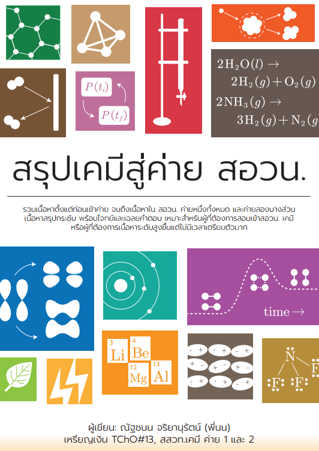
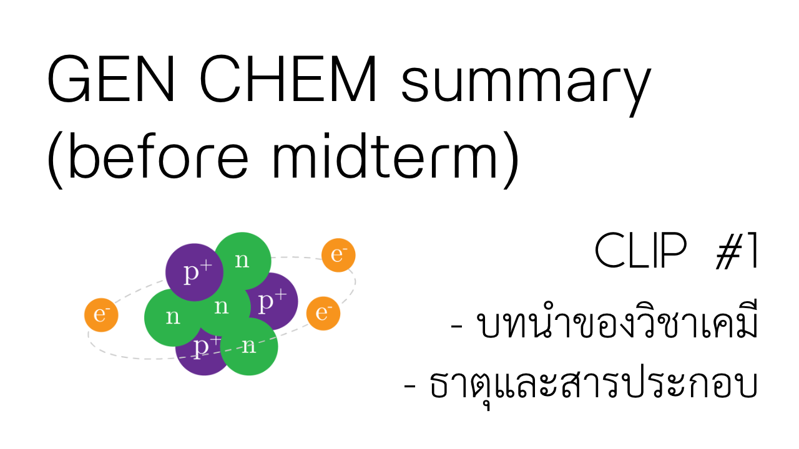
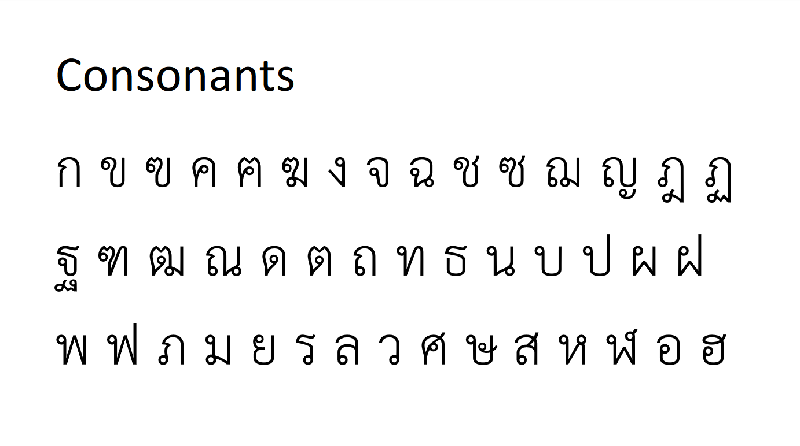
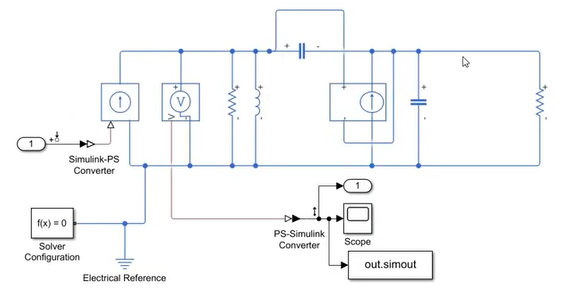

# My publications and teaching materials :orange_book:

|  | **Chemistry for POSN** ([meb](https://www.mebmarket.com/index.php?action=BookDetails&book_id=131905), [pdf](https://mega.nz/folder/TvASnJwY#58Ycdea5AcsCpJMfnpZhQw)). the 400-page free-to-download book for preparing for National Chemistry Olympiad camp in Thailand ([POSN](https://www.posn.or.th/en/home-en)), now has over 3000 downloads. |
|  | **Chemistry for PAT3** ([meb](https://www.mebmarket.com/ebook-168255-%E0%B8%AA%E0%B8%A3%E0%B8%B8%E0%B8%9B%E0%B9%80%E0%B8%84%E0%B8%A1%E0%B8%B5-PAT3), [pdf](https://mega.nz/folder/TvASnJwY#58Ycdea5AcsCpJMfnpZhQw)). the free-to-download book for preparing for engineering national entrance exam. (Thailand has changed its national university admission system ***[again](/images/thaifuckadmission.png)*** in 2022, so PAT3 is no more.)|
|  | **GEN CHEM Summary for 1st year Chulalongkorn U. engineering students** ([YouTube](https://www.youtube.com/watch?v=huH6TsueCXs&list=PLTdRcLBoM705KTlA7Mc8hau6G6LQP1gk9)) It's total length is 11 hours.|
|  | **How to read Thai in less than 5 hours** ([YouTube](https://www.youtube.com/watch?v=MvKYBeSFAgo), [pdf](https://mega.nz/folder/62h1iAyR#cuewC1S2NsrPM4-ReMzRRQ)) |
|  | **How to use MATLAB/Simulink to simulate electrical circuits** ([YouTube](https://www.youtube.com/watch?v=F2ZQiFW14Ig)) |
