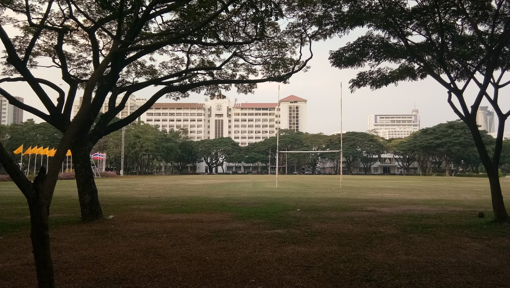
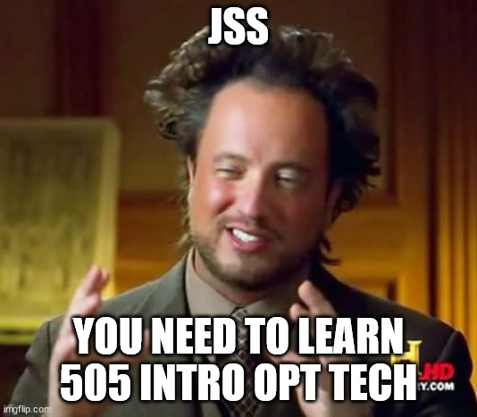
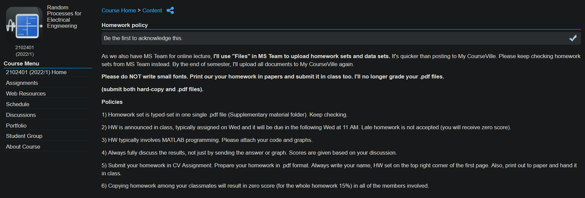

# CUEE (formerly EECU) Courses Review by Nutchanon J :books:
{: .no_toc }

(Edited: Aug. 2025; grammars)

*Chulalongkorn University (Photo by me)*

This review does not emphasize how the professors teach each subject. The review summarizes why we should learn this topic and how it can be applied to subsequent courses. The review also includes the workload of each course, so you can decide how many credits you want to register for each semester.

Three metrics are given:
- Quantity of Content: How much content is in the course?
- Course Workload: How many hours of homework and projects are in the course? Please note that this **does not include** the time that you have to read or review the content, or prepare for the exam(s).
- Exam Difficulty: How difficult the exams (midterm, final, quizzes) are.

Also, this review will be very centered on electronics and control systems, since I am pursuing my studies in these two fields.

{: .warning } 
My review may be out of date. To be specific, Year 2 of mine is A.Y.2020, Year 3 of mine is A.Y.2021, and Year 4 of mine is A.Y.2022. (A.Y. = academic year.) Please note that 2020 and 2021 were heavily affected by the COVID-19 pandemic, and the review of teaching would not be accurate. Hence, I focus on the content of each course instead.

The recommended textbooks will be written with **boldface**.

  

    Table of contents
  

  {: .text-delta }
- TOC
{:toc}

## Year 2 Semester 1

*Bhumibol Bridge (Photo from Yee Associates)*

### EE201: ELECT ENG MATH I

Quantity of Content: :star: :star: :star: :star: \\
Course Workload: (No HWs and projects) \\
Exam Difficulty: :star: :star: :star: :star: 

You will learn about all techniques involved in solving differential equations, solving difference equations, Fourier series and Fourier transform, Laplace transform, and Z-transform. Lastly, you will learn to solve partial differential equations (PDEs).

Firstly, you will solve them (linear differential equations, linear difference equations) the hard way (characteristic equations and some very magical techniques), and then, bam, you discover that the Laplace transform and Z-transform really help you in solving those more easily.

Fourier series and Fourier transform will appear in many communication courses, because they are the methods by which the waves are decomposed. Fourier series is applied to periodic waves, and the Fourier transform is applied to aperiodic waves. Both are related, and I persuade you to find that connection.

The Laplace transform will appear in every subject related to control system theory. The word “transfer function” is heavily reliant on the Laplace transform. You will find this word for the first time in CIR THEORY I/LAB, when you learn about the frequency response of a circuit.

The Z-transform will be found in discrete-time system analysis. Digital control systems and digital signal processing courses heavily rely on the Z-transform. However, you will not study those courses until the 4th year of EE.

Partial differential equations will not be found in many EE courses (in my opinion). It has appeared in electromagnetics and quantum mechanics. If you want to pursue those courses in the future, I recommend that you learn PDEs thoroughly.

I recommend that you learn the course from **[Ajarn Supatana](https://ee.eng.chula.ac.th/supatana-auethavekiat/)’s lecture notes**, and also her scrap papers during her teaching, since her techniques for solving this math are really wonderful. Some techniques are not even presented in modern textbooks anymore.

The class skips these topics: Series solutions of linear equations (you will miss some special functions like Bessel’s or Legendre’s,) Systems of linear and nonlinear equations ( you will see those in LIN CON SYS I anyway, but you will miss something like phase portraits,) Numerical methods (of which, in the past, is separated to another advanced course, but now that course is abolished. Maybe because now, it is a computer who took the job!?)

For those who want to rely on a textbook, I recommend **Differential Equations with Boundary Value Problems by Dennis G. Zill**. If you have time and dedication, I think you should read that book entirely. For the Z-Transform, you will need other textbooks. I recommend **Discrete-Time Signal Processing by Oppenheim** or **Digital Control System Analysis and Design by Charles L. Phillips**.

For the exams, I do not recommend that you rely on textbooks, since the exams will be much harder than the problems in textbooks. Instead, rely on [Ajarn Supatana](https://ee.eng.chula.ac.th/supatana-auethavekiat/)’s lecture notes and her collected former exams.

---

### EE203: PROB STAT ELEC ENG

Quantity of Content: :star: :star: \\
Course Workload: :star: :star: \\
Exam Difficulty: :star: :star:

You will learn all of the basics in statistics required in EE. The course is very easy in my opinion.

For the main textbook accompanied by the teaching, please refer to the professor. However, these are my recommendations for those who are really into it.

**Introduction to Probability by Joe Blitzstein and Jessica Hwang**: This is my FAVORITE book so far! I recommend that if you really want to understand and have a firm foundation in statistics, this book is a must. The book covers all of the topics before the midterm. For the topics after that, you need another textbook, that is:

**Mathematical Statistics with Applications by Dennis Wackerly**: This book is better than other textbooks because of its very strong mathematical handling. I recommend that if you really want to understand statistics to its mathematical core, this book is also a must. The book covers all of the topics after the midterm, and additionally covers many interesting topics, such as linear modeling, ANOVA, categorical data, nonparametric statistics, and Bayesian inference. I finished this book after the course because the topics provided were so interesting.

**Introductory Statistics by Neil A. Weiss**: For those who have time, I found this book to be more practical, not heavily theoretical, so that you can see more easily how statistics can be applied to real-world problems. I think it is suitable for someone who does not want to learn stats by seeing many, many math theorems.

---

### EE213: CIR THEORY I/LAB

Quantity of Content: :star: :star: :star: \\
Course Workload: :star: :star: \\
Exam Difficulty: :star: :star: :star:

This is essential for every EE student, period.

The textbook used by the professor for many years is **Engineering Circuit Analysis by William H. Hayt**. However, I found some errors in that book that I do not personally recommend. The book that I recommend is **Fundamentals of Electric Circuits by Charles K. Alexander, Matthew N.O. Sadiku**.

The book (6th edition) covers all of the topics that you require to learn in this course. The prof will skip Chapters 6, 7, and 8 because those first- and second-order circuits can be solved more easily by the Laplace transform, not the direct ODE. Furthermore, I strongly recommend that you understand the Bode plot to comprehend the frequency response of a circuit more easily. (Also, it may help you on the exam!) Laplace and Fourier transforms will be skipped in this course (because you will learn them in ELECT ENG MATH I). The two-port networks will be taught in CIR THEORY II/LAB. The op-amp will be taught in ETRON CIRCUIT/LAB (2nd semester of the 3rd year).

P.S. This course has lab exams. I recommend that you go and practice when there is an allocated time provided by the professor before the lab exam. (Even though this is not an obligation, it will help you.)

---

### ME213: ENG MECHANICS I

Quantity of Content: :star: :star: :star: \\
Course Workload: :star: \\
Exam Difficulty: :star: :star: :star:

The only subject from Mechanical Engineering. Both **Engineering Mechanics by R. Hibbeler** or by **J.L. Meriam & L.G. Kraige** will do you a favor. Do the homework by yourself since one of the problems will appear on the exam. End of the review. Good luck.

---

### MATH207: CALCULUS III

Quantity of Content: :star: :star: :star: :star: \\
Course Workload: (No HWs and projects) \\
Exam Difficulty: :star: :star: :star: :star: :star:

This is the essence. Do not believe someone who says this course is useless. Electromagnetics requires this course. If you want to learn something like optimization techniques, understanding from this course is a must.

I recommend that you do the exercises provided by the professor by yourself, just like what you have done in CALCULUS I and CALCULUS II. The exam will be as hard as that. Prof’s handouts are enough. But if not, any international calculus textbooks will do you a favor. I personally recommend **Calculus: Early Transcendentals by Howard Anton, Irl Bivens, and Stephen Davis**. Read the entire book, trust me, you are going to use all of those topics in many subsequent courses.

---

## Year 2 Semester 2

*Philadelphia, PA, United States (Photo by Trev Adams)*

### EE202: ELECT ENG MATH II

Quantity of Content: :star: :star: :star: :star: \\
Course Workload: (No HWs and projects) \\
Exam Difficulty: :star: :star: :star: :star: :star:

This is the only course in which I have gotten a B+ so far.

I, personally, find that **[Ajarn Jitkomut](http://jitkomut.eng.chula.ac.th/)’s slides on Linear Algebra**, and **[Ajarn Suchin](https://ee.eng.chula.ac.th/suchin-arunsawatwong/)’s slides on Complex Analysis** should be enough for you to get through this course. However, if you want to rely on textbooks, my recommendations are these textbooks:

**Linear Algebra and Its Applications by David Lay, Steven Lay, and Judi McDonald**: The first five chapters in the book (5th edition) will be all taught before the midterm. Chapter 6 (orthogonality, least squares, Gram-Schmidt) and Chapter 7 (Symmetric matrices and Quadratic form) will not be taught. However, I recommend that you read those anyway since they are going to reappear in many subsequent courses (PRINC COMM, LIN CONT SYS II, RANDOM PROC EE, etc.)

I want to emphasize that Linear Algebra is very important in every field of engineering. You should take this course very seriously.

**Complex Variables and Applications by Brown and Churchill**: The holy grail of complex analysis, in my opinion. The first seven chapters in the book (9th edition) will be taught after the midterm. I found these topics have no direct application in electrical engineering yet, but they will help explain many topics found in control systems (e.g., Nyquist stability criteria). If you don’t want to blindly accept those topics, learn the materials. The bonuses of this course are

- You will finally know how to evaluate some improper integrals, which can be solved much more easily by the residue theorem.
- You will finally know how to evaluate the inverse Laplace transform without finding the partial fraction of a function (but you will not do it that way anyway).
---

### EE214: CIR THEORY II

Quantity of Content: :star: :star: \\
Course Workload: :star: :star: \\
Exam Difficulty: :star: :star: :star: 

In my opinion, this course material has not been updated at all. The book that professors are still using is **Network Analysis and Synthesis by Franklin F. Kuo**. Seriously, this book was published in *1966*, the year my father was born. I would not recommend this book to any new EE students since the way this book handles electrical circuits is obviously outdated. Anyway, I still recommend it to those who want to understand how circuits are analysed before the time when computers were very rampant. Nowadays, it is more common to use state-space to analyse any linear models (e.g., linear circuits). In the book mentioned, the author used a full matrix representation to analyse the voltages of all nodes, or the currents of all paths, to analyse the circuit. Obviously, this is very computationally-heavy! The practices for the problems that are going to be on the exam are also virtually nonexistent since this technique is already outdated. However, there are problems from [Ajarn Manop](https://ee.eng.chula.ac.th/manop-wongsaisuwan/) that can be solved by hand and checked by Simscape Electrical. I also had done it almost entirely, and they should be in the EE resources’ Google Drive.

Before the midterm, you will learn the topic mentioned above. After the midterm, more modern techniques such as state-space models and two-port networks will be taught. You can go back to use **Fundamentals of Electric Circuits by Charles K. Alexander, Matthew N.O. Sadiku** to follow those topics again. I want to emphasize that this course is very connected to Linear Algebra in ELECT ENG MATH II. I also want to emphasize that this course will make you appreciate LIN CONT SYS I more, since the way of analyzing electrical circuits will be directly applied to general linear models (mechanical, thermal, etc.) in that course.

---

### EE222: ENG EMAG

Quantity of Content: :star: :star: :star: :star: \\
Course Workload: :star: :star: \\
Exam Difficulty: :star: :star: :star: :star: :star: 

Follow **[Ajarn Supatana](https://ee.eng.chula.ac.th/supatana-auethavekiat/)’s lecture notes and her former exams** and you will be fine. End of the review. (Sorry, just kidding.)

This course is very important for those who want to study in the field of communication. (Telecommunication, Microwave, Optics, Antennas, etc.)

My book recommendations are:

**Introduction to Electrodynamics by David J. Griffiths**: Honestly, this is the holy grail. You may think that you already understand electromagnetics from your first-year courses; *no*, you’re not, until you read this book.

The first 9 chapters in the book (4th edition) will be taught in the course. If you cannot self-study from this book, please attend the class and use this book as a reference. Ajarn Supatana has so many techniques to approach EM problems that they will not be found in textbooks. However, the book will strengthen your understanding of electromagnetics in a very significant way. I still recommend that you read this book!

**Field and Wave Electromagnetics by Cheng**: This book is actually a book used by the course’s professors. I do not read the book myself, but my friend [Taran](https://www.facebook.com/nineza.taran) recommends this book so often that I decided it should be on the recommended list. This book is very connected to the future courses in communication (transmission line, waveguide, antenna). So, I do recommend that if you don’t want the feeling of too much physics-oriented explaining in the previously mentioned book, this book is more EE-oriented and recommended to those who want to pursue further in communication.

**Electromagnetism: Problems with Solutions by Pramanik**: How the authors can compile so many problems in EM is astonishing. I recommend that if you really have time and get bored with former exams, go for this book.

---

### EE253: ELEC MACH I

Quantity of Content: :star: :star: :star: \\
Course Workload: :star: :star: \\
Exam Difficulty: :star: :star: :star: 

This is the first course that is, in my opinion, practical-oriented.

**Electric Machinery Fundamentals by Chapman** is the book used by the professor, and I recommend that you read the entire book, since every topic is relevant to electrical machinery these days. I also recommend that, for those who find this book not theoretical enough, you go for **Fitzgerald & Kingsley's Electric Machinery by Umans**. I personally had no time to read the latter book, though.

---

## Year 3 Semester 1

*Saint Petersburg, Russia (Photo by Serj Sakharovskiy)*

### EE360: ELEC POWER SYS I

Quantity of Content: :star: :star: :star: \\
Course Workload: :star: \\
Exam Difficulty: :star: :star: :star: 

To be honest, this is the course that I did not pay much attention to. (How I can get an A from this course is still astonishing to me!?) 

The prof's slides, materials, and former exams should be enough for the course. If you are interested in this course, please refer to **Power System Analysis and Design by J. Duncan Glover**. I heard that this book can be used further in ELEC POWER SYS II as well.

---

### EE385: SEMICON DEV I

Quantity of Content: :star: :star: :star: :star: \\
Course Workload: (No HWs and projects) \\
Exam Difficulty: :star: :star: :star: 

This is where many EE students find themselves, whether they really want to pursue further in electronics or not.

This course is taught entirely by [Ajarn Songpol](https://ee.eng.chula.ac.th/songphol-kanjanachuchai/) in my year, and he's very good at it. You will learn all of the essential topics related to semiconductors. *Essential* is not an exaggerated word: these topics will be useful when you take ETRON CIRCUIT/LAB next semester. 

The textbook that Ajarn Songpol has used for many years is **Solid State Electronic Devices by Ben Streetman**. I find that book good if you want to learn fast. If you want to learn these topics in a more physics-oriented way, I recommend you read **Semiconductor Physics and Devices by Donald A. Neamen** for a more in-depth understanding. (Again, if you have time.)

---

### EE371: PRINC COMM/LAB

Quantity of Content: :star: :star: :star: :star: \\
Course Workload: :star: :star: \\
Exam Difficulty: :star: :star: :star: 

This course gives you many basic topics about communication in general. Some say it is useful, and some say it cannot provide any pictorial understanding of communication at all. I am in the former group; I find it useful enough for me, who doesn't want to study further in the communication field.

The textbook that I relied on, in parallel with the prof's slides and materials, is **Modern Digital and Analog Communication Systems by B. P. Lathi**. I found it readable for any beginner. [Ajarn Nisachon](https://ee.eng.chula.ac.th/nisachon-tangsangiumvisai/) says that the course relies on **Digital and Analog Communication Systems by Leon Couch**, but I found it very hard to read for beginners. Some people recommend the book **Communication Systems by Michael Moher and Simon Haykin**, but I haven't read that book yet.

---

### EE387: FUND DIGIT CIRC

Quantity of Content: :star: :star: :star: :star: \\
Course Workload: :star: :star: :star: \\
Exam Difficulty: :star: :star: :star: 

{: .note } 
I have wanted to say this for a long time: You don't have to love SEMICON DEV I and ETRON CIRCUIT/LAB to decide whether you want to pursue further studies in electronics or not. The field of electronics is so huge that you don't have to be good at everything.

{: .warning } 
I heard that for subsequent years, professors would want you to use the Xilinx Vivado software suite. You should have your own computer with AT LEAST 200 GB OF FREE SPACE to install that. If not, you need to have some generous friends whom you can rely on for their computers.

This course is the first course in electronics (along with SEMICON DEV I). This is the first step in digital design.

All of the basics will be taught in this course. The pair of books that I used simultaneously is:

**Digital Fundamentals by Thomas L. Floyd**: This book is made for beginners, which is why I find it very easy to read. Furthermore, it includes topics in common digital ICs used in discrete electronics (74 series). It also includes many common electronics knowledge that I personally find very helpful. All in all, I recommend that anyone who wants to go further in digital electronics read this book entirely. Nevertheless, this book does not cover all of the topics in FUND DIGIT CIRC. (It lacks the topic about the state machine.) The next book that covers all topics in this subject is

**Fundamentals of Logic Design by Charles H. Roth**: This book is very in-depth. In the book (7th edition), Units 1 through 13 will be taught in this course (seriously.) Some topics will be skipped (e.g., Quine-McCluskey method, hazards in digital circuits, etc.) The rest of the topics are also very interesting if you want to work in digital design in the future. Following this book, along with the course, will give you the best understanding.

This course uses VHDL to synthesize digital logic (even though Verilog is more popular). For VHDL, the book by Charles H. Roth mentioned above has some units dedicated to VHDL, but I found them insufficient. I personally find **Free Range VHDL by Bryan Mealy and Fabrizio Tappero** to be very helpful for a beginner who wants to start fast. (This book is FREE; you can search it for yourself on Google.) Anyway, this book does not include the topic on testbench (and many advanced topics about VHDL). For more in-depth topics, you should follow **The Designer's Guide to VHDL by Peter J. Ashenden**.

For anyone interested in Verilog, I recommend **Quick Start Guide To Verilog by Brock J. LaMeres**.

---

### EE333: LIN CONT SYS I/LAB

Quantity of Content: :star: :star: :star: :star: \\
Course Workload: :star: :star: :star: \\
Exam Difficulty: :star: :star: :star: :star: :star:

The first course in control system theory. Since I'm in the field of electronics, this course is very important (trust me.)

I personally found that [Ajarn Manop](https://ee.eng.chula.ac.th/manop-wongsaisuwan/)'s slide for this course is very easy to read, but not enough for in-depth understanding. You should rely on additional examples and explanations in textbooks to achieve a real understanding in this course. (If you want to.) The recommended books are:

**Modern Control Engineering by Katsuhiko Ogata**: This is the book that is recommended by [Ajarn Suchin](https://ee.eng.chula.ac.th/suchin-arunsawatwong/), and I will also recommend this book to you. This book is very easy to read, and my friend [Taran](https://www.facebook.com/nineza.taran) also agrees with me. Chapters 1 through 7 in the book (5th edition) will be taught in this course. (You can safely skip Chapter 4.) Chapter 8, the PID, can be read for further understanding. Chapters 9 and 10 will be covered in LIN CONT SYS II.

For other books, there are **Modern Control Systems by Richard C. Dorf**, but I find it hard to read for beginners, and **Control Systems Engineering by Norman S. Nise**, but I have not read it yet.

{: .note } 
For those who find this course very hard: I personally read all of the topics in this course 3 TIMES to make an A out of it.

---

## Year 3 Semester 2

*Jiufen, Taiwan (Photo by We Fun Taiwan)*

{: .note } 
This is where the fun begin.

### EE308: PROP ELEC ENG MAT

Quantity of Content: :star: :star: :star: :star: \\
Course Workload: :star: \\
Exam Difficulty: :star: :star: :star: 

I personally hate this course, lol. (Don't mind me.)

You can rely on the prof's slides entirely, and you should be fine. The textbook used by the professor is **Principles of Electronic Materials and Devices by S. O. Kasap**, but I have no time to read that book. Good luck.

---

### EE311: ELEC MEAS/INSTRU

Quantity of Content: :star: :star: :star: \\
Course Workload: :star: \\
Exam Difficulty: :star: :star: 

This course teaches you the basics of electrical instrumentation and measurements. I personally find this course useful. The course has no companion textbook. Some of the topics are out of date, in my opinion. Relying on the prof's slides only, and you should be fine. End of the review.

---

### EE386: ETRON CIRCUIT/LAB

Quantity of Content: :star: :star: :star: :star: :star: \\
Course Workload: :star: :star: :star: :star: \\
Exam Difficulty: :star: :star: :star: :star: :star: 

I personally do not recommend that you rely on the professor's slides to fully understand this course! [They will never be enough!](https://www.youtube.com/watch?v=6jZVsr7q-tE)

Finally, one of the courses that I found the instructors not so very helpful (only [Ajarn Boonchuay](https://ee.eng.chula.ac.th/boonchuay-supmonchai/) and [Ajarn Napong](https://ee.eng.chula.ac.th/napong-panitantum/) are good, the other are :unamused:.) If you want to pursue analog design further, PLEASE use the textbooks. THIS COURSE IS HARD AS IT IS SUPPOSED TO BE! I recommend that for someone who goes for analog or microelectronics in general, please refer to:

**Microelectronic Circuits - Sedra & Smith**: This book is the best, in my opinion. Only warning is that the arrangement of the topics in this book is not the same as in the course, so you need to learn fast enough if you want to rely on this book along with the course. I recommend this book first because I love how its content is arranged.

If you want to use this book (7th edition) along with the course, this is my advice:
- Firstly, you should review the basics of semiconductors from Chapter 3.
- Then, you need to learn about device physics (BJT and MOS) from Chapters 5 and 6.
- The BJT amplifier will be taught first; you read it in Chapter 7. I recommend that you understand how the resistance-reflection rule works.
- Also, you need to learn more about the frequency response of a BJT amplifier. You read that from Chapter 10 for those relevant topics. The prof is generous if you are lucky, so only the frequency response of the common-emitter configuration will be asked in the exam.
- Secondly, the MOS amplifier will be taught. You go back to Chapter 7 again. MOS is easier than BJT since there is no gate (base) current.
- Some of the MOS amp configurations will be new for you (e.g., cascoding, current mirror, etc.) You should read Chapter 8.
- Also, you need to learn more about the frequency response of a MOS amplifier, so you go back to Chapter 10 to read about that. If the professor is generous, again, only the frequency response of the common-source configuration will be asked for in the exam.
- For the op amp, you read from Chapter 2. This is the easiest topic that you will learn from this course.
- For the basics of current mirror, differential amp, analog filter, and some oscillators, you read those from Chapters 8, 9, 17, and 18. The oscillator circuit is analysed more easily if you know things about feedback in Chapter 11.

Chapters 11 and 13 will be taught further in PRIN ANALOG CIR. Chapters 14 to 16 are very helpful if you want to study the DIG IC in the future.

If you want to read the textbook that has its content arranged in the same way as the course, you can refer to **Microelectronics Circuit Analysis and Design by Donald A. Neamen**. I cannot comment on that book since I have not read it yet. (I just skimmed it.) Other recommended textbooks are **Fundamentals of Microelectronics by Behzad Razavi** and **Microelectronic Circuit Design by Richard C. Jaeger**, which I haven't read yet, either.

{: .note } 
The terminology used in this course is not the same as in any standard textbook. It is also not mentioned by the prof AT ALL. (Why? :expressionless:) So, I note it here: 
- A(vin) = voltage gain with no load and no source resistance
- A(vn) = voltage gain with no load but with source resistance
- A(vi) = voltage gain with load but no source resistance
- A(v) = voltage gain with load and source resistance

---

### EE432: LIN CONT SYS II (compulsory elective; control system theory)

Quantity of Content: :star: :star: :star: :star: \\
Course Workload: :star: :star: :star: \\
Exam Difficulty: :star: :star: :star: :star: :star: 

I would like to say that this is a course that teaches all the things that you should have learnt in ELECT ENG MATH II and LIN CONT SYS I, but have not learnt yet.

For the first half before midterm, [Ajarn David](https://ee.eng.chula.ac.th/david-banjerdpongchai/) will review all of the mathematical topics relevant to the course. Some topics that you have not learnt yet are:
- QR factorization and Gram-Schmidt algorithm. (Why was it not taught in ELECT ENG MATH II?)
- left and right eigenvalues/eigenvectors.
- least-square solution and pseudoinverse.
- Jordan canonical form.

Then, for the second half after midterm, (finally) the topics are shifted to control system theory.
- controllability and observability.
- minimalization of the control system.
- state-space feedback design.
- state observer and observer-based controller.
- introduction to servomechanism problem.
- optimal state feedback (LQR problem).

The advanced topics will be taught, but will not appear on the exam:
- optimal LQG control design.
- robust control design.
- model predictive control design. (MPC)

For the recommended book, I suggest that for the first half, you should rely on any linear algebra textbook (I have recommended **Linear Algebra and Its Applications by David Lay, Steven Lay, and Judi McDonald** in ELECT ENG MATH II, and you should be fine if you have read it all.)

For the second half, you can rely on the last 2 Chapters (5th edition) of **Modern Control Engineering by Katsuhiko Ogata**, but it won't be enough. **[Ajarn David](https://ee.eng.chula.ac.th/david-banjerdpongchai/)'s slides** should be enough and I find it *relatively* easy to read by yourself. I found that **A Linear Systems Primer by Panos J. Antsaklis** is very mathematically concise. (For instance, many practical-oriented books, such as Ogata or Dorf, do not differentiate between *controllability* and *reachability* anymore, but this book from Antsaklis does explain how both are different.) So, I recommend that book if you have time.

P.S. Most of the slides from Ajarn David are brought from Stephen Boyd's EE263 materials of Stanford University. [Link](https://ee263.stanford.edu/archive/).

---

### EE444: INTRO EMBED SYS (compulsory elective; electronics)

Quantity of Content: :star: :star: :star: :star: \\
Course Workload: :star: :star: :star: :star: \\
Exam Difficulty: :star: 

This course is a rely-on-yourself course. I'm not kidding.

For the first half, you will learn about C and C++. You will also learn some (very little) computer architecture relevant to embedded systems. The AVR assembly language will be taught (a little).

For the second half, you will learn about Arduino (hands-on). You will also learn about some embedded system low-level communication (SPI, I2C, CAN, etc.) 

The recommended book for learning C by yourself is **C: How to Program by Harvey Deitel and Paul Deitel**. Actually, you can learn C from any source since it is a relatively easy programming language. 

For C++, the situation is very different. C++ is easy to learn but very hard to master. ([You can see this meme.](https://www.reddit.com/r/ProgrammerHumor/comments/7eyrbx/how_to_learn_programming_in_21_days/)) For a quick start, I recommend **C++ Programming by D. S. Malik**. Until you find yourself saying "Fuck, I could not understand other C++ codes even though I read that book," I suggest you read further in:

**C++ Primer by Stanley B. Lippman**: This is recommended by so many Reddit users in the programming field. Very hard to read in my opinion, but I got through this book and have no regret afterward. It will take your time and your brain energy. Get prepared for pointers (a LOT of.) Be prepared for a headache.

**Programming - Principles and Practice Using C++ by Bjarne Stroustrup**: Written by the creator of C++ himself, this is also recommended by so many (I mean 99% of) Reddit users. The only downside of this book is that it is very big and takes a lot of time for a beginner. But hey! C++ is supposed to take a lot of time anyway! So why not just read this book to save any further headache?

For Arduino programming, I think learn from your own projects (those will be provided in the class anyway) is the best way. 

Class materials should be enough for the exam. But for anyone's further curiosity, I suggest that you read **Making Embedded Systems by Elecia White**. It is the *overview* in the professional world of embedded design.

---

### CP574: AI ENG (free elective; a course from computer engineering)

Quantity of Content: :star: :star: :star: \\
Course Workload: :star: :star: :star: (If you do them by yourself.) \\
Exam Difficulty: (No exams.)

{: .note } 
This is not a course in EE. This is a course from CP that is open to any student **except** for those from CP.

I love this course, the reasons are
- A is guaranteed for those who submit all homework on time. (On time = before the final exam.)
- There is no exam in this class.
- How much you learn from this course depends on how much you work on it. You can struggle through the HWs and get skills, or you can copy others' HWs effortlessly and get nothing. (Academic integrity is a thing, and I don't recommend you do that.)
- You can do all the work yourself. This course has no group project, so congratulations to introverts.

Course materials and class attendance should be enough for you to get through this course. You don't need to get an A in the 1st year computer programming course to be good in this AI ENG course. This course DOES NOT guarantee that you will get a job in ML or data analytics or something. Anyway, this course is recommended by me because you will learn the best practices in ML and data analytics from the professors themselves. Many professors are actively finding someone who wants to work in ML (as a research assistant) from these course members; some of my friends in EE got research work from the CP professor from this course. Again, this course provides many opportunities, but it depends on how much you work for them.

Course content for each week:
- Week 1: Introduction to AI for Engineers
- Week 2: State-Space Search
- Week 3: Iterative Improvement Algorithm
- Week 4: Machine Learning Pipeline
- Week 6: Linear Regression
- Week 7: Logistic Regression
- Week 8: Naive Bayes Classifier
- Week 9: Decision Tree
- Week 10: Unsupervised Learning
- Week 11: Neural Networks
- Week 12: CNN
- Week 13: Transfer Learning
- Week 14: Sequence Modeling

---

### EE447: ETRON ENG LAB (compulsory lab; electronics)

Quantity of Content: :star: :star: \\
Course Workload: :star: :star: :star: :star: \\
Exam Difficulty: (No exams.)

There are 3 labs. 
- The first one was designing an amplifier for the ECG signal. In my year, it was done entirely in LTspice. In A.Y.2022 (on-site teaching), I heard from my friend that it was done by discrete components on a breadboard.
- The second one was designing an IR break beam sensor system for pass-through-a-door detection. I did this lab on-site. The discrete components given by the lab were sometimes (30 - 40%) broken, so you have to test them one-by-one by yourself (recommended). This lab took so much time.
- The last one was about IoT. Follow the instructions and you will be fine.

This course is fun (in my opinion). Professors are not very strict about the neatness of the lab reports.

---

### EE436: CONT INSTRU LAB (compulsory lab; control system theory)

Quantity of Content: :star: :star: \\
Course Workload: :star: :star: :star: :star: :star: \\
Exam Difficulty: (No exams.)

I will not talk about the labs; I will talk about the workload.
- You will be in a group of 3-5 people (depending on how many students are in the section).
- All lab reports have to be done **in a very strict way**. (Do not make them like primary school students.) Note that this has to be done for **all labs**.
- There are 8 labs (8 weeks and you are done.)

This is the sample report from my year ([link](https://mega.nz/file/Sqo0ULgJ#l6xQNdXdEu9vac-iRfbxxAgqInuQ7fctSG9ElQpIDVs).) Note that this is an average work for one lab. Do not underestimate this course: it takes so much time. Choose your partners wisely.

---

## Year 4 Semester 1

*Kyoto, Japan (Photo by Kristin Wilson)*

{: .warning } 
This semester is very heavy. I DO NOT RECOMMEND YOU TO TAKE 22 CREDITS MAX OR MORE THAN THAT! I assume that you still want to have a life outside of studying. I also assume that you don't want a life like medical students, who need more than 60 hours per week of studying. This semester has a pre-project course. This semester has many courses which are supposed to be for Master students, and those courses are much heavier than you had imagined when you were in the 2nd or 3rd year. So, please do not underestimate this semester. You will hate yourself if you are studying too much.

### EE401: RANDOM PROC EE (compulsory elective; control system theory)

Quantity of Content: :star: :star: :star: :star: :star: \\
Course Workload: :star: :star: :star: :star: :star: (JSS), :star: :star: (CPW) \\
Exam Difficulty: :star: :star: :star: :star: :star: (JSS), :star: :star: :star: :star: (CPW)

This is the course that teaches all the things that you should have learnt in ELECT ENG MATH II, PROB STAT ELEC ENG, and PRINC COMM, but have not learnt yet.

For the first half before midterm, [Ajarn Jitkomut](http://jitkomut.eng.chula.ac.th/) will teach you all of the basics

Topics that are taught in this course (that should be in the PROB STAT ELEC ENG) are:
- Markov chains
- characteristic functions of distributions
- many special characteristics of the Gaussian
- random vectors
- principal component analysis
- etc.

Topics that are taught in this course (that should be in the ELECT ENG MATH II) are:
- symmetric matrix
- orthogonality and orthonormality
- unitary matrix
- properties of definite matrices

For the second half of this course, [Ajarn Charnchai](https://ee.eng.chula.ac.th/charnchai-pluempitiwiriyawej/) will teach (finally) about the topics in random processes. The book used by both professors is **Probability, Statistics, and Random Processes For Electrical Engineering by Alberto Leon-Garcia**. To be honest, I find *so many errors* in that book that it caused some annoyance for me, but whatever. Ajarn Charnchai will teach on Chapters 9 and 10 in that book (3rd edition).

I find the classes on random processes to have so many approaches to be taught. Ajarn Jitkomut will approach this course in a data analytics-oriented way since her research is related to that field. For Ajarn Charnchai, the approach is communication-oriented. Many really essential topics (in my speculation) in random processes are skipped, such as queueing theory (it is taught in another course, that is TRAF ENG COMM NET by [Ajarn Chaodit](https://ee.eng.chula.ac.th/chaodit-aswakul/)). In my opinion, the field of random (stochastic) processes is freaking huge! The other book recommendations from me are **Essentials of Stochastic Processes by Rick Durrett** and **Introduction to Stochastic Processes with R by Robert P. Dobrow**.

---

### EE427: MMEDIA COMPR TECH (elective; communication)

Quantity of Content: :star: :star: :star: :star: :star: \\
Course Workload: :star: :star: :star: \\
Exam Difficulty: :star: :star: :star: :star:

Why I'm in this course is still mesmerizing, lol.

This course is recommended for those who want to learn the data compression techniques in a very concise way. I don't know how [Ajarn Supavadee](https://ee.eng.chula.ac.th/supavadee-aramvith/) can compress all of the topics into just one semester!? The book used in this course is the holy grail, the one and only, **Handbook of Data Compression by David Salomon**. This book is more than 1300 pages long! I found myself unable to learn this topic by myself, obviously, so I took this course.

Bonuses from this course are that you will finally know 
- Why can ffmpeg cut the MPEG video in a lossless way only at certain keyframes?
- Why can JPEG compression be done at more than a 50% compression ratio without visible changes?
- how f--king complex modern audio compression (MP3) is.

---

### EE433: DIG CONT SYS (compulsory elective; control system theory)

Quantity of Content: :star: :star: :star: :star: \\
Course Workload: :star: :star: \\
Exam Difficulty: :star: :star: :star: 

I strongly recommend that you take LIN CONT SYS II before this course.

The course materials mostly overlap with the LIN CONT SYS II material. Anyway, some topics are new, and I recommend that those who are interested in digital control systems but have already taken the LIN CONT SYS II should still take this course.

The topics that do not overlap with the LIN CONT SYS II are:
- zero-order hold
- continuous-time to discrete-time system estimation
- designing a discrete-time system to meet step response specifications (how is it different from a continuous-time system?)
- reduced-order state observer (did not appear in the exam.)
- generalized linear observer (did not appear in the exam.)
- Kalman equation for solving the Riccati equation.

For the book, I strongly recommend that you read **Digital Control and State Variable Methods by M. Gopal**. This book is very comprehensive, mathematically concise, and practical-oriented. I also strongly recommend **Digital Control System Analysis and Design by Charles L. Phillips**. This book discusses a reduced-order state observer.

Last comment: Why is the Jury stability criterion not covered in this course???

---

### EE489: PRIN ANALOG CIR (compulsory elective; electronics)

Quantity of Content: :star: :star: :star: :star: :star: :star: \\
Course Workload: :star: :star: :star: :star: \\
Exam Difficulty: :star: :star: :star: :star: :star: 

Note: BJT is forgotten.

This course is supposed to continue with the ETRON CIRCUIT/LAB from the last semester. This includes

- More MOS characteristics.
- More topologies of Amplifiers.
- More Differential Ampifiers.
- More Current Mirrors.
- More Frequency responses.
- Noise.
- Feedback.
- Op-Amp internal circuit.
- Frequency compensation techniques (not on the exam.)

To be honest, if you hate ETRON CIRCUIT/LAB, you will hate PRIN ANALOG CIR more. Consider your decision to take this course thoroughly.

The recommended books are:

**Design of analog CMOS integrated circuits by Behzad Razavi**: The holy grail in analog circuit design. Read this book thoroughly, and you should be fine for this course. 

**Analysis and Design of Analog Integrated Circuits by Paul R. Gray**: This book is for my reference. I personally find that this book is not for beginners, but for someone who needs a variety of analog circuit references with very concise mathematical handling. 

**CMOS Circuit Design, Layout, and Simulation by R. Jacob Baker**: This book is recommended by so many people that I decided it should be on the list. It covers so many essential topics in microelectronics that you should know. I find this book to be more practical-oriented than theoretical-oriented, so you can learn from this book based on your own interests.

**Microelectronic Circuits - Sedra & Smith**: This book will never be enough for this course. However, I found the explanation of feedback topologies in the Razavi book to be very hard to read. I found that Sedra & Smith explain feedback topologies much, much better.

I would like to say that you will not have time in this semester, so read only this first book, and you should be fine. Also, I strongly recommend that you read the quick review from [Ajarn Boonchuay](https://ee.eng.chula.ac.th/boonchuay-supmonchai/) since his materials are very helpful in quick analog circuit analysis. He is going to retire in 2023, so I will put his materials (together with those of [Ajarn Napong](https://ee.eng.chula.ac.th/napong-panitantum/)) here: [Link](https://mega.nz/folder/ynQi1DSZ#adxcxV-sO7ii0TwU4iqCeA)

---

### EE505: INTRO OPT TECH (elective; control system theory)

Quantity of Content: :star: :star: :star: :star: \\
Course Workload: :star: :star: :star: :star: :star: :star:\\
Exam Difficulty: :star: :star: :star: :star: :star: 

This course is hard. I bombed the final exam *entirely*.

The topics in this course are:
- mathematics review
- solving nonlinear equations (bisection, Newton-Raphson, secant)
- unconstrained optimization:
    - optimality conditions
    - line search (bisection, golden section, quadratic, and cubic interpolation)
    - steepest descent method
    - Newton's method
    - conjugate direction methods
    - quasi-Newton methods
- constrained optimization:
    - optimality conditions (including KKT)
    - linear programming
    - active set method for quadratic programming with linear constraints

You need to love mathematical proving to do this course homework. You also need to love MATLAB.

The recommended books are:

**An Introduction to Optimization by Edwin K. P. Chong**: This book is used by [Ajarn Suchin](https://ee.eng.chula.ac.th/suchin-arunsawatwong/), and I find it relatively easy to read. Use this book along with the professor's materials, and you should have the best understanding of this course.

**Linear and Nonlinear Programming by David Luenberger**: This book is used worldwide. I recommended that you also use this book along with the course.

**Algorithms for Optimization by Tim A. Wheeler and Mykel J. Kochenderfer**: If you don't know where to start in coding MATLAB, you can start from this book. Even though this book uses Julia as a programming language, you should have no difficulty applying those to your own MATLAB work.

To be honest, I find this course to be somewhat heavier in mathematical theory than it should be. The final exam also requires real brain power to do numerical things, and proving mathematical problems in a 3-hour exam, for me, was exhausting. Since Ajarn Suchin will retire next year (2023), Ajarn Jitkomut will take his place to teach this course. You can see how the course will be taught in the future (speculation, again) from this [link](http://jitkomut.eng.chula.ac.th/optim.html).

---

### EE545: DIG IC (elective; electronics)

Quantity of Content: :star: :star: :star: :star: :star: \\
Course Workload: :star: :star: :star: :star: :star: :star:\\
Exam Difficulty: :star: :star: 

For those who want to do digital design in the future, I recommend that you take this course. It is not required, though. (You don't have to know how to fabricate an IC to do digital design, but it is always helpful.)

This course is all about how to implement what you have learnt in FUND DIGIT CIRCUIT in the real IC. The topics covered are:

- MOS characteristics (including short-channel nonideality).
- IC fabrication.
- Wiring in IC.
- Delay.
- Static and Dynamic logics.
- Combinational (NAND, NOR) and Sequential (flipflop, latch) logics and layouts.
- Timing constraints.
- Arithmetic circuits and datapath.
- Testing of digital logics.

The recommended book is **CMOS VLSI Design: A Circuits and Systems Perspective by Neil Weste and David Harris**.

---

## Year 4 Semester 2

{: .note }
I decided to take only 2 subjects in that semester because I needed to take (many) Chinese courses at that time before going to Taiwan for my Master's degree. Also, I didn't know how much the senior project workload would be at the time, too. 

### EE546: ANALOG IC (elective; electronics)

Quantity of Content: :star: :star: :star: :star: :star: :star: \\
Course Workload: :star: :star: :star: :star: :star: \\
Exam Difficulty: :star: :star: :star: :star:

Firstly, [Ajarn Napong](https://ee.eng.chula.ac.th/napong-panitantum/) will teach you some essential analog components that are not covered yet in EE489 (PRIN ANALOG CIR). These are:

- Bandgap References (a.k.a. how to generate a very-precise reference voltage, that is temperature-independent.)
- Oscillators 
- Phase-Locked Loop
- Switched-Capacitor Circuits

For these four topics above, they rely on the same textbook **Design of analog CMOS integrated circuits by Behzad Razavi** that you should already be accustomed to if you have learnt EE489 before. However, for the topic of "Switched-Capacitor Circuits," Ajarn Napong will use the new textbook: **Analog Integrated Circuit Design by Tony Chan Carusone**. This textbook will cover Switched-Capacitor Circuits in the time-domain, Z-transform sense, which could be used further in filter design. The design procedure will be greatly helped by the Z-transform, and it will make more sense if you have learnt EE433 (DIG CONT SYS) before.

Then, Tony Chan Carusone's textbook will be mainly used. The topics that will be covered further are:

- Data converters
    - Nyquist-Rate ADC
    - Nyquist-Rate DAC
    - Oversampling ADC/DAC (with the famous Delta-Sigma converter.)

These, for me, are the whole new world where analog has changed its feeling. You will use more mathematics than the physics of devices for the first time here. Also, there will be the feeling that finally, you know how the digital world could help the analog world to operate in a proper, good way.

Finally, there will be a final project. Ajarn Napong will give you 2 projects (as of my semester), and you will only choose one.

These are:

- Designing system-level oversampling ADC/DAC on the Academic Process Design Kit by Institut de Microelectrònica de Barcelona. If you are motivated enough, you can learn it from here: [link](http://www.cnm.es/users/pserra/apdk/).
- Use skywater130 pdk to reduplicate the circuit on some papers on IEEE and compare the result. You can see how to install the toolchain easily in my video on YouTube: [link](https://www.youtube.com/watch?v=l5ollq9Nbl8). Also, the project that I've done with Makkawan Lohitsiri for you to see as an example can be found in [link](https://nutchanonj.github.io/pages/12_analog_ic_design/).

The final project is very comprehensive. I recommend that you definitely take this course if you want to do analog circuit design in the future. 

---

### EE519: REINFORCE LRN APP (elective; Data Science Master's Degree at CUEE)

Yes, I took this course because [Ajarn Chaodit](https://ee.eng.chula.ac.th/chaodit-aswakul/).

This course weighs only 1 credit and is taught for only 5 weeks equivalent. (In my semester, it is 3 full days.) The textbook used in this course is the holy grail, **Reinforcement Learning: An Introduction by Andrew Barto and Richard S. Sutton**. Ajarn Chaodit will try to teach up to Chapter 7th in that book. Even though his style of teaching is very slow (in my opinion only), if you have a good wit, I recommend that you go through that book by yourself prior to class.

Also, if you want to have a good summary, Lilian Weng of OpenAI has made a very good, concise content for you: [Here](https://lilianweng.github.io/posts/2018-02-19-rl-overview/) and [Here](https://lilianweng.github.io/posts/2018-04-08-policy-gradient/).

In my opinion, this course is so damn good. An eye-opener for me. Compared to the optimization techniques, the reinforcement-learning approach seems to use less maths and more common sense to achieve something.

---

Even though I didn't take some courses, there are some book recommendations that are worth mentioning here for those who take these courses:
- EE575: STAT INFER MODEL
    - An Introduction to Statistical Learning: With Applications in R by Daniela Witten, Gareth James, Robert Tibshirani, and Trevor Hastie.
    - The Elements of Statistical Learning by Jerome H. Friedman, Robert Tibshirani, and Trevor Hastie
    - Pattern Recognition and Machine Learning by Christopher M. Bishop
    - For other books, pls refer to [Ajarn Jitkomut's website](http://jitkomut.eng.chula.ac.th/ee575.html).
- EE423: DIG SIG PROC
    - Digital Signal Processing by John Proakis and Dimitris Manolakis.
    - (My friend Taran and I find the DSP book by Alan V. Oppenheim too hard to read.)

## Some Study Guide

{: .note } 
To answer this, I decided to write it as a Q&A so that it is more engaging.

{: .warning } 
DISCLAIMER: You don't have to do all of these. These are only my suggestions. The expectations from studying are varied. So, you don't have to do all these things.

### Q1: Should I just learn the materials, or just do the exercises and former exams?
{: .no_toc }

A1: TL; DR: Do both.

I would like to say that, ideally, the exams of a course should be the feedback on how much you understand the coursework. However, no professor could give you much feedback since s/he have no time. Hence, you must feed back to yourself how much you have learnt by doing exercises and former exams by yourself. It may be true that you can do those things without fully understanding the concepts of coursework, but it's not worth doing that. Some (many) courses are the prerequisites for the subsequent courses, so some (or many) misunderstandings from the prior course(s) would be a big burden for you in the future. Therefore, you should have time to contemplate the concepts taught in the courses to understand them to the core. It is supposed to take time.

---

### Q2: Should I rely only on the professor’s materials, or should I study further in the associated textbook(s)?
{: .no_toc }

A2: It depends on how difficult the exams are, or how good the quality of teaching in the course, or ultimately, how much you want to learn.

I would like to say that for the 2nd year courses, the quality of teaching is still very good. Relying on attending the class and doing your homework/exercises/former exams should be enough; textbooks are used for curiosity. Until the 3rd year, some courses are taught in an ill-mannered way, so you have to rely on textbook(s) for those courses. You can rely on my CUEE courses review to see the recommended textbooks for each course.

---

### Q3: The Textbook is very hard to read. What is the recommended way to learn from a textbook?
{: .no_toc }

A3: This is my recommendation:
- Step 1: Study from the course materials first to see the keywords or key concepts of the course.
- Step 2: Skim through the textbook to see how the content in the textbook is associated with the keywords or key concepts of the course. This way, you will have some prior idea or picture of the content, and it will help you with the process of comprehension from the textbook.
- Step 3: Read it thoroughly.

I would like to say that for each course, you don’t have to read the entire textbook. Read just some parts of it that are not beyond your *frontier of knowledge*. 

I also recommended that some courses really need professors to guide what you must learn from a course (a.k.a., the key concepts). It’s faster to learn this way.

Also, there will be textbooks that you love and hate, e.g., some of the textbooks are readable for you, but some aren’t. I recommend that you read some of its chapters to determine whether you are ok with the book or not. That is why in my CUEE course review, there are some courses that I recommend 2-3 books, so you can choose them to your liking.

---

### Q4: You mentioned the *frontier of knowledge* in the last Q&A. What is it?
{: .no_toc }

A4: There will be times when you read the textbook and not understand it at all. It indicates that this content is beyond your *frontier of knowledge*.

For a concrete example, suppose that you want to read about microelectronics from Sedra & Smith. At some point, you need to know some concepts from LIN CON SYS I (root locus, Nyquist’s stability criteria, etc.) to understand how the feedback in circuits works. Surely, there will be a brief review about those topics, but it will assume that you already know those, so the review is very succinct and unfriendly to the novice.

What can you do about this situation? One of the ways is that you have to learn about the LIN CON SYS I concept first from professors. What if you are in a hurry? Then, you need to read LIN CON SYS I by yourself. Maybe from Ogata or Dorf. What if you don’t understand the text by reading it yourself? Consult the EE Math II materials on what you don’t really understand. This process is recursive. This requires patience and time.

---

### Q5: I am not good at reading English. How can I learn from textbooks that are mostly written in English?
{: .no_toc }

A5: Then you read the textbook. Everyone must start somewhere. If you don’t know the word, use the dictionary, and note the meaning in the book directly. You will thank yourself later when you have to take TOEIC, TOEFL, or IELTS before applying for jobs or graduate admissions, or when you have to read a fuckton of research papers in the 4th year. I agree with you that if you are not good at English, reading textbooks will take much more time, but it is worth it. You will thank yourself later.

---

### Q6: Should I buy the textbook, or print it out from a downloaded (pirated) file, or just read it on iPad?
{: .no_toc }

A6: You can use www Dot libgen DOT rs to load the textbooks. (Pirated.) Don’t forget to sort by year so you can get the latest edition of the book. If you are going to read a lot, print it; your eyes are precious. If you can afford the book or you really appreciate the writer, then you buy the book.

However, I don’t recommend you buy the book before downloading it and reading some chapters. This is because you don’t know yet if the book is really for you. Again, there will be textbooks that you love and hate, e.g., some of the textbooks are readable for you, but some aren’t. So, I recommend that you read some of its chapters to determine whether you are ok with the book or not before buying it. In addition, the library of Chula Engineering has many great textbooks (not kidding, some are out-of-date editions but still very good resources) that you can borrow, so you can be frugal.

Also, there will be times when Chula Book Center dumps the price of their international textbooks to an insanely low price. (I had an experience when the price of Cryptography and Network Security by Stallings was sold at 99 baht!?) The promotion usually takes place at the end of each year. So, go check the prices; you may be lucky!

---

### Q7: Reading textbook(s) is a very heavy task; should I really read the textbook(s)?
{: .no_toc }

A7: Yes. This is the undergrad, not a school.

---

### Q8: Is one textbook for a course enough or not?
{: .no_toc }

A8: Usually not. You can see from my CUEE courses review that I recommend 2-3 books so you can use them in parallel in a course. Surely there will be one main textbook that you read, but the other are also essential as additional references. This is the way of study; one textbook is usually not enough to understand the course. Fortunately, this is the age of the Internet (and lots of pirated textbooks).

---

### Q9: Does academic integrity really matter? Do professors really do the investigation and punishment when there is misconduct in academic integrity?
{: .no_toc }

A9: There is a chance that you will get caught, and it is never worth it. DO NOT CHEAT, EVEN COPYING HWs! Especially for some professors (e.g., JSS), the consequence is not worth it at all.

 
Do you think this HW policy is long and tedious? The answer is not. For the prestigious universities, like UC Berkeley, the 3-page-long document for Academic Misconduct Policy is very common. You can see the example [here](https://fa22.datastructur.es/materials/guides/academic-misconduct/).

{: .warning }
I have warned you. It's not worth it.

---

### Q10: I have finished the 2nd year now and am still hesitating about which majors I should choose. (Power, Communication, Electronics, Control System.) Is that normal?
{: .no_toc }

A10: Yes. However, you should finally decide after finishing the 1st semester of 3rd year, in which you will learn all the fundamentals in those four majors. Trust me, at that time you will know what you really want to study.

---

### Q11: Can I choose three majors in (Power, Communication, Electronics, Control Systems)?
{: .no_toc }

A11: Yes. There were people in the past who could do that. Personally, I do not recommend you do that since you will not have enough time to take the non-compulsory electives in each field, so you will know things like a jack of all trades and a master of none.

---

### Q12: There are too many electives that I want to learn. Should I take more than 22 credits per semester so I can learn all of those?
{: .no_toc }

A12: You can, but it is not recommended. Even if you really want to do so, taking more than 23-24 credits will be considered heavily by the registrar. The process will take about 1 to 2 months, and you have to declare explicitly why you really want to take that many credits (mine is a 2-page-long document).

Even if you can get through that tedious process, taking more than 22 credits will exhaust your time so much that you will hate yourself. Also, your health will deteriorate.

My recommendation is that you only take the courses that you really want to understand, or that you cannot self-study. You don't have to know everything!!

---

### Q13: How much GPAX is great?
{: .no_toc }

A13: I would like to say that GPAX above 3.80 is already very great, but beyond that, it is not significant anymore. Taking time for other things (competition, self-study, internship, part-time paid or unpaid work) is better. Also, please note that if you want to study a Master's at a top U. (internationally) in the future, immediately after graduation, GPAX is important. Some universities declare the average GPAX of the admitted students. For example, U. of Melbourne has admitted Master's students with an average GPAX of about 3.7-3.8 (IIRC).

---

### Q14: What should I prepare if I want to study a Master's program in a top international university in the future (after graduation)?
{: .no_toc }

**GPAX** – Above 3.80 and you should be fine. Below this is also fine if you have a strong background (internships, research works, activities, competitions, etc.) Note that anything could happen. Good luck.

**English assessments** – TOEFL and IELTS are both fine. Universities in both the U.S. and the U.K./E.U. are now generally accepting both tests. TOEFL 100 is recommended. Also, each part (writing, speaking, listening, reading) should be more than 22, and you are safe. This is from my searching through lots of (more than 50) universities' admission requirements. The exam result (both TOEFL and IELTS) can be kept for 2 years.

P.S. If you want to talk with a computer, take the TOEFL. In contrast, if you want to talk with a human, take IELTS. The costs are not different that much.

**GRE** – Some universities require you to take this test. There are three sections: Verbal, Quantitative, and Analytical. The verbal section is like an English test; its vocabulary is difficult and not found in everyday life. The quantitative section is like an easy math test that you, the EE student, should be fine with. The analytical section is a critical-thinking kind of writing test. I personally have not taken the exam yet. This exam requires lots of preparation. The exam result can be kept for 5 years.

The other important things are your activities and internships. I recommend that you also have those in the portfolio.

For others, you can prepare it at the time of application (letter of recommendations, statement of purpose, passport, and your picture; those do not take so much time). I will talk about those later in another post.